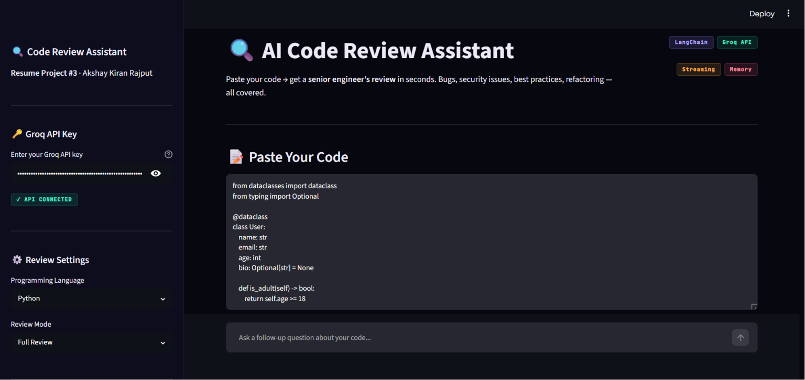
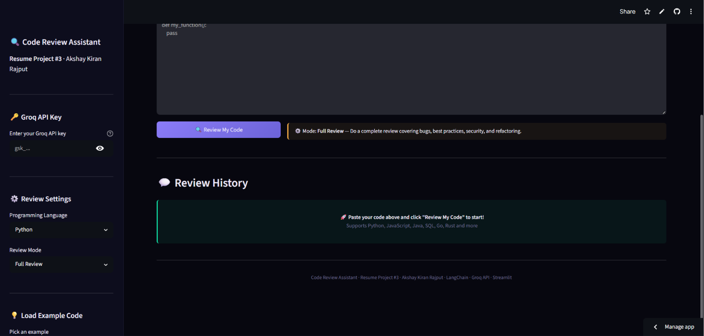
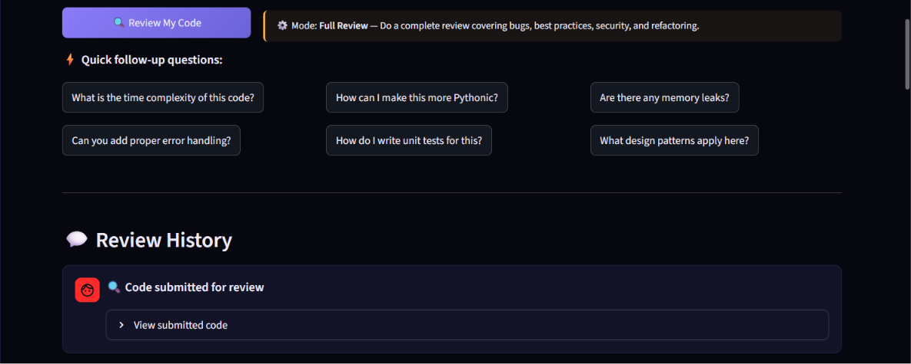
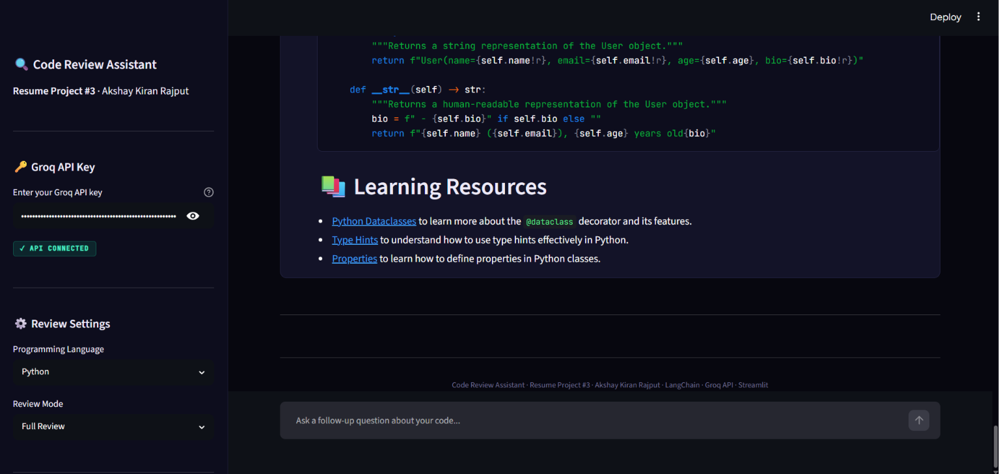
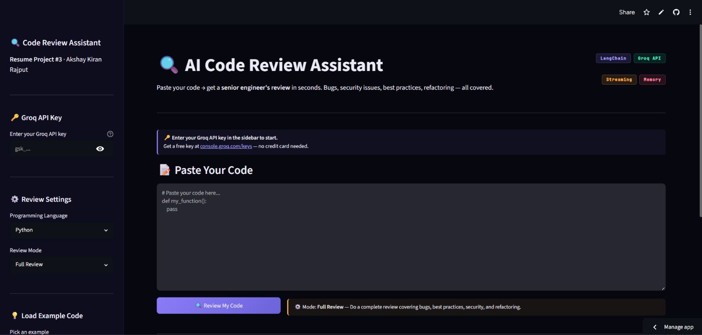
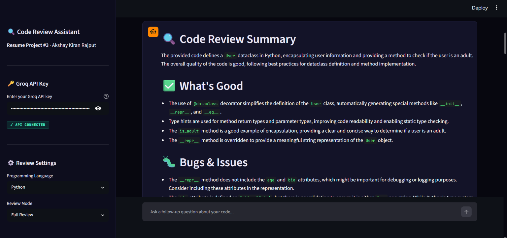

<div align="center">

# 🔍 AI Code Review Assistant

**Resume Project #3 · Akshay Kiran Rajput · GenAI Developer Portfolio**

Paste code → get a senior engineer's review in seconds.
Bugs · Security · Best Practices · Refactored Code · Streamed live.

[](https://python.org)
[](https://streamlit.io)
[](https://langchain.com)
[](https://groq.com)
[](LICENSE)

### 🚀 [Live Demo → code-review-bot.streamlit.app](https://code-review-bot.streamlit.app/)

</div>

---

## 📸 Application Screenshots

Experience the complete workflow of the **AI Code Review Assistant**—from securely connecting a Groq API key to receiving a detailed AI-powered code review with streaming responses and conversation memory.

### 🏠 Home Screen

<p align="center">
  
</p>

Paste your source code, choose the programming language, select a review mode, and securely connect your Groq API key.

---

### ⚡ Review History & Quick Follow-up Prompts

<p align="center">
  
</p>

Continue the conversation using built-in follow-up prompts such as:

* Time Complexity
* Unit Tests
* Design Patterns
* Error Handling
* Performance Improvements

---

### 🔍 AI Code Review Summary

<p align="center">
  
</p>

Receive a structured senior-engineer style review including:

* Executive Summary
* Code Quality
* Bugs & Issues
* Security Analysis
* Performance Recommendations
* Best Practices
* Refactored Code

---

### 📚 Recommendations & Learning Resources

<p align="center">
  
</p>

Every review concludes with actionable recommendations, improved implementations, and learning resources to help developers write cleaner, safer, and more maintainable code.

---

### ☁️ Live Streamlit Deployment

<p align="center">
  
</p>

The application is deployed on **Streamlit Cloud** and can be accessed directly through the browser without any local setup.

---

### 💬 Multi-turn Conversation Memory

<p align="center">
  
</p>

Conversation history is preserved using LangChain's `MessagesPlaceholder`, enabling contextual follow-up questions and maintaining the flow of the code review session.

---

## 🧠 What It Does

Upload any code snippet and this tool acts as a **senior engineer reviewing your pull request** — streaming a structured, detailed review back to you in real time. Ask follow-up questions and it remembers the full conversation context.

Built to demonstrate:
- Real-world **LangChain** chain composition with memory
- **Groq API** integration with token-by-token streaming
- **Real API key validation** — live test call rejects fake keys instantly
- Multi-turn **conversational AI** in a production-style Streamlit UI
- Clean, modular Python project structure deployed on Streamlit Cloud

---

## ✨ Features

| Feature | Details |
|---|---|
| 🎯 **5 Review Modes** | Full Review · Bug Hunt · Security Audit · Performance · Beginner Friendly |
| 🌐 **16 Languages** | Python · JavaScript · TypeScript · Java · Go · Rust · SQL · C++ · Bash · and more |
| ⚡ **Streaming Responses** | Token-by-token output via Groq's LPU — faster than any GPU inference |
| 🧠 **Conversation Memory** | LangChain `MessagesPlaceholder` keeps last 20 messages in context |
| 🔑 **Real API Key Validation** | Live test call on key entry — rejects fake/invalid keys instantly |
| 💬 **Quick Follow-up Prompts** | One-click: time complexity · unit tests · design patterns · error handling |
| 📦 **4 Built-in Examples** | SQL injection bug · Async race condition · O(n²) loop · Clean code reference |
| 📊 **Session Stats** | Review count and message count tracked live in sidebar |

---

## 🏗 Architecture

```
┌─────────────────────────────────────────────────────────────┐
│                    Streamlit Frontend                        │
│         Code Input · Mode Selector · Chat History           │
└─────────────────────┬───────────────────────────────────────┘
                      │  user message
                      ▼
┌─────────────────────────────────────────────────────────────┐
│                    LangChain Chain                           │
│                                                             │
│   ChatPromptTemplate                                        │
│   ├── SystemMessage  →  Senior Engineer persona             │
│   ├── MessagesPlaceholder  →  last 20 messages (memory)     │
│   └── HumanMessage  →  code + language + review mode       │
│                      │                                      │
│                      ▼                                      │
│   ChatGroq  (llama-3.3-70b-versatile, streaming=True)      │
│                      │                                      │
│                      ▼                                      │
│   StrOutputParser  →  streamed text chunks                  │
└─────────────────────┬───────────────────────────────────────┘
                      │  streamed tokens
                      ▼
┌─────────────────────────────────────────────────────────────┐
│          st.empty() live markdown renderer                   │
│          response builds character by character             │
└─────────────────────────────────────────────────────────────┘
```

---

## 📁 Project Structure

```
Code_Review_Bot/
│
├── app.py            ← Streamlit UI — sidebar, chat, streaming renderer
├── llm_engine.py     ← LangChain chain · API key validation · streaming
├── config.py         ← System prompt · model config · languages · examples
│
├── requirements.txt  ← Pinned dependencies
├── .env              ← GROQ_API_KEY (never commit this!)
├── .gitignore        ← Excludes .env and __pycache__
├── test_groq.py      ← Standalone key validator script
└── README.md
```

---

## ⚡ Run Locally

### 1. Clone

```bash
git clone https://github.com/Akshay291/Code_Review_Bot.git
cd Code_Review_Bot
```

### 2. Install dependencies

```bash
pip install -r requirements.txt
```

### 3. Get a free Groq API key

Go to **[console.groq.com/keys](https://console.groq.com/keys)** → Sign up → Create API Key
No credit card needed. Free tier: **30 req/min · 14,400 req/day**

### 4. Add key to `.env`

```env
GROQ_API_KEY=gsk_your_key_here
```

### 5. (Optional) Verify your key

```bash
python test_groq.py
# ✅ Groq API is working!
```

### 6. Launch

```bash
streamlit run app.py
```

Open **http://localhost:8501** in your browser.

---

## 🌐 Deploy on Streamlit Cloud (Free)

1. Push this repo to GitHub
2. Go to **[share.streamlit.io](https://share.streamlit.io)**
3. Connect repo → select `app.py` → click **Deploy**
4. In app settings → **Secrets**, add:
   ```toml
   GROQ_API_KEY = "gsk_your_key_here"
   ```
5. Your live URL: **[code-review-bot.streamlit.app](https://code-review-bot.streamlit.app/)**

---

## 🔑 Review Modes

| Mode                   | What It Does                                                          |
| ---------------------- | --------------------------------------------------------------------- |
| **Full Review**        | Complete audit — bugs, best practices, security, refactored code      |
| **Bug Hunt Only**      | Laser-focused on logical errors and incorrect behavior               |
| **Security Audit**     | SQL injection · exposed secrets · invalidate input · unsafe patterns |
| **Performance Review** | Algorithmic complexity · bottlenecks · memory usage · optimization    |
| **Beginner Friendly**  | Encouraging tone · plain explanations · learning-focused feedback     |

---

## 🤖 Model

| Property            | Value                               |
| ------------------- | ----------------------------------- |
| **Provider**        | [Groq](https://groq.com)            |
| **Model**           | `llama-3.3-70b-versatile`           |
| **Free Tier**       | ✅ 30 req/min · 14,400 req/day      |
| **Inference Speed** | ~500 tokens/sec (Groq LPU hardware) |
| **Works in India**  | ✅ No regional restrictions         |
| **Context Window**  | 128K tokens                         |

---

## 🛠 Tech Stack

| Layer                 | Technology                                               |
| --------------------- | -------------------------------------------------------- |
| **UI**                | Streamlit · Custom CSS (dark glassmorphism theme)        |
| **LLM Orchestration** | LangChain 0.3 · `ChatGroq` · `ChatPromptTemplate`        |
| **AI Model**          | LLaMA 3.3 70B via Groq API                               |
| **Memory**            | `MessagesPlaceholder` — stateful multi-turn conversation |
| **Streaming**         | `chain.stream()` → `st.empty()` live renderer            |
| **Config**            | `python-dotenv` · centralized `config.py`                |

---

## ✍️ Resume Bullets

```
• Built an AI Code Review chatbot using LangChain + Groq API (LLaMA 3.3 70B)
  with real-time token-by-token streaming and multi-turn conversation memory
  across follow-up questions — deployed live on Streamlit Cloud

• Engineered 5 dynamic review modes (Full Review, Bug Hunt, Security Audit,
  Performance, Beginner Friendly) using adaptive system prompting that
  restructures the LLM's output format based on user selection

• Implemented real API key validation via live Groq test call on entry,
  LangChain MessagesPlaceholder memory retaining last 20 messages, and
  graceful error handling for rate limits and auth failures
```

---

## 👤 Author

**Akshay Kiran Rajput**
MCA Student · Jain Online University · Surat, India

[](https://www.linkedin.com/in/akshay-rajput-0925b8264)
[](https://github.com/Akshay291)
[](mailto:akshayrajput2914@gmail.com)
[](https://code-review-bot.streamlit.app/)

---

<div align="center">
<sub>Code Review Assistant · Resume Project #3 · Built with LangChain · Groq · Streamlit</sub>
</div>


---

## 🧠 What It Does

Upload any code snippet and this tool acts as a **senior engineer reviewing your pull request** — streaming a structured, detailed review back to you in real time. Ask follow-up questions and it remembers the full conversation context.

Built to demonstrate:
- Real-world **LangChain** chain composition with memory
- **Groq API** integration with token-by-token streaming
- **Real API key validation** — live test call rejects fake keys instantly
- Multi-turn **conversational AI** in a production-style Streamlit UI
- Clean, modular Python project structure deployed on Streamlit Cloud

---

## ✨ Features

| Feature | Details |
|---|---|
| 🎯 **5 Review Modes** | Full Review · Bug Hunt · Security Audit · Performance · Beginner Friendly |
| 🌐 **16 Languages** | Python · JavaScript · TypeScript · Java · Go · Rust · SQL · C++ · Bash · and more |
| ⚡ **Streaming Responses** | Token-by-token output via Groq's LPU — faster than any GPU inference |
| 🧠 **Conversation Memory** | LangChain `MessagesPlaceholder` keeps last 20 messages in context |
| 🔑 **Real API Key Validation** | Live test call on key entry — rejects fake/invalid keys instantly |
| 💬 **Quick Follow-up Prompts** | One-click: time complexity · unit tests · design patterns · error handling |
| 📦 **4 Built-in Examples** | SQL injection bug · Async race condition · O(n²) loop · Clean code reference |
| 📊 **Session Stats** | Review count and message count tracked live in sidebar |

---

## 🏗 Architecture

```
┌─────────────────────────────────────────────────────────────┐
│                    Streamlit Frontend                        │
│         Code Input · Mode Selector · Chat History           │
└─────────────────────┬───────────────────────────────────────┘
                      │  user message
                      ▼
┌─────────────────────────────────────────────────────────────┐
│                    LangChain Chain                           │
│                                                             │
│   ChatPromptTemplate                                        │
│   ├── SystemMessage  →  Senior Engineer persona             │
│   ├── MessagesPlaceholder  →  last 20 messages (memory)     │
│   └── HumanMessage  →  code + language + review mode       │
│                      │                                      │
│                      ▼                                      │
│   ChatGroq  (llama-3.3-70b-versatile, streaming=True)      │
│                      │                                      │
│                      ▼                                      │
│   StrOutputParser  →  streamed text chunks                  │
└─────────────────────┬───────────────────────────────────────┘
                      │  streamed tokens
                      ▼
┌─────────────────────────────────────────────────────────────┐
│          st.empty() live markdown renderer                   │
│          response builds character by character             │
└─────────────────────────────────────────────────────────────┘
```

---

## 📁 Project Structure

```
Code_Review_Bot/
│
├── app.py            ← Streamlit UI — sidebar, chat, streaming renderer
├── llm_engine.py     ← LangChain chain · API key validation · streaming
├── config.py         ← System prompt · model config · languages · examples
│
├── requirements.txt  ← Pinned dependencies
├── .env              ← GROQ_API_KEY (never commit this!)
├── .gitignore        ← Excludes .env and __pycache__
├── test_groq.py      ← Standalone key validator script
└── README.md
```

---

## ⚡ Run Locally

### 1. Clone

```bash
git clone https://github.com/Akshay291/Code_Review_Bot.git
cd Code_Review_Bot
```

### 2. Install dependencies

```bash
pip install -r requirements.txt
```

### 3. Get a free Groq API key

Go to **[console.groq.com/keys](https://console.groq.com/keys)** → Sign up → Create API Key
No credit card needed. Free tier: **30 req/min · 14,400 req/day**

### 4. Add key to `.env`

```env
GROQ_API_KEY=gsk_your_key_here
```

### 5. (Optional) Verify your key

```bash
python test_groq.py
# ✅ Groq API is working!
```

### 6. Launch

```bash
streamlit run app.py
```

Open **http://localhost:8501** in your browser.

---

## 🌐 Deploy on Streamlit Cloud (Free)

1. Push this repo to GitHub
2. Go to **[share.streamlit.io](https://share.streamlit.io)**
3. Connect repo → select `app.py` → click **Deploy**
4. In app settings → **Secrets**, add:
   ```toml
   GROQ_API_KEY = "gsk_your_key_here"
   ```
5. Your live URL: **[code-review-bot.streamlit.app](https://code-review-bot.streamlit.app/)**

---

## 🔑 Review Modes

| Mode                   | What It Does                                                          |
| ---------------------- | --------------------------------------------------------------------- |
| **Full Review**        | Complete audit — bugs, best practices, security, refactored code      |
| **Bug Hunt Only**      | Laser-focused on logical errors and incorrect behavior               |
| **Security Audit**     | SQL injection · exposed secrets · invalidate input · unsafe patterns |
| **Performance Review** | Algorithmic complexity · bottlenecks · memory usage · optimization    |
| **Beginner Friendly**  | Encouraging tone · plain explanations · learning-focused feedback     |

---

## 🤖 Model

| Property            | Value                               |
| ------------------- | ----------------------------------- |
| **Provider**        | [Groq](https://groq.com)            |
| **Model**           | `llama-3.3-70b-versatile`           |
| **Free Tier**       | ✅ 30 req/min · 14,400 req/day      |
| **Inference Speed** | ~500 tokens/sec (Groq LPU hardware) |
| **Works in India**  | ✅ No regional restrictions         |
| **Context Window**  | 128K tokens                         |

---

## 🛠 Tech Stack

| Layer                 | Technology                                               |
| --------------------- | -------------------------------------------------------- |
| **UI**                | Streamlit · Custom CSS (dark glassmorphism theme)        |
| **LLM Orchestration** | LangChain 0.3 · `ChatGroq` · `ChatPromptTemplate`        |
| **AI Model**          | LLaMA 3.3 70B via Groq API                               |
| **Memory**            | `MessagesPlaceholder` — stateful multi-turn conversation |
| **Streaming**         | `chain.stream()` → `st.empty()` live renderer            |
| **Config**            | `python-dotenv` · centralized `config.py`                |

---

## ✍️ Resume Bullets

```
• Built an AI Code Review chatbot using LangChain + Groq API (LLaMA 3.3 70B)
  with real-time token-by-token streaming and multi-turn conversation memory
  across follow-up questions — deployed live on Streamlit Cloud

• Engineered 5 dynamic review modes (Full Review, Bug Hunt, Security Audit,
  Performance, Beginner Friendly) using adaptive system prompting that
  restructures the LLM's output format based on user selection

• Implemented real API key validation via live Groq test call on entry,
  LangChain MessagesPlaceholder memory retaining last 20 messages, and
  graceful error handling for rate limits and auth failures
```

---

## 👤 Author

**Akshay Kiran Rajput**
MCA Student · Jain Online University · Surat, India

[](https://www.linkedin.com/in/akshay-rajput-0925b8264)
[](https://github.com/Akshay291)
[](mailto:akshayrajput2914@gmail.com)
[](https://code-review-bot.streamlit.app/)

---

<div align="center">
<sub>Code Review Assistant · Resume Project #3 · Built with LangChain · Groq · Streamlit</sub>
</div>
